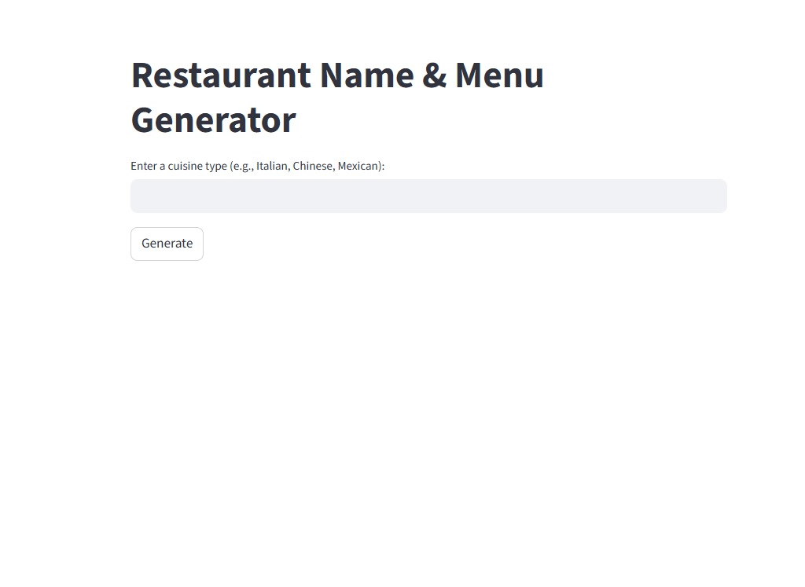
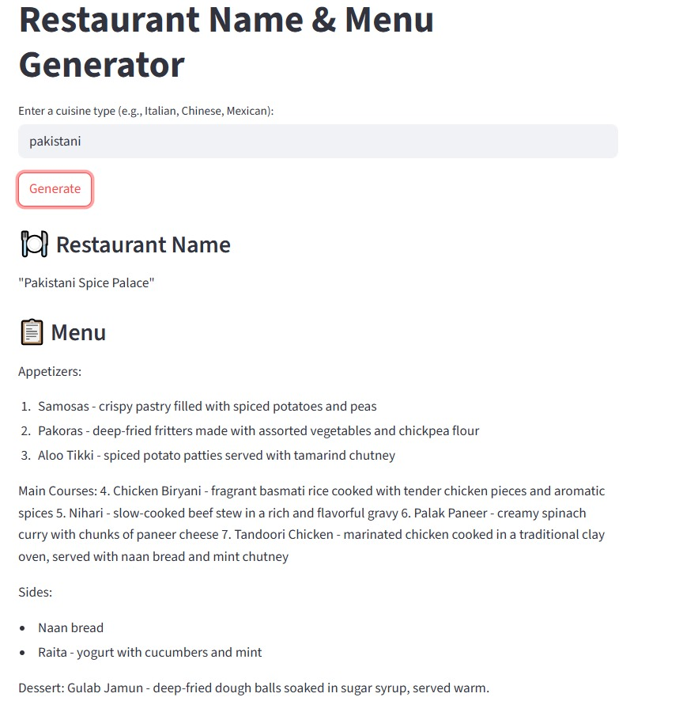

# 🍽️ Restaurant Name & Menu Generator

This is a fun and creative AI-powered Streamlit application that generates a unique restaurant name and a detailed menu based on your chosen cuisine. It uses **OpenAI's GPT** models with the **LangChain** framework to chain multiple prompts together for seamless generation.

---

## 🚀 Demo Preview

### 🔷 UI Preview


### 🔷 Output Example


---

## 🧠 How It Works

1. You enter a **cuisine type** (e.g., Italian, Chinese, Pakistani).
2. The app generates a **creative restaurant name** using an LLM.
3. Based on the generated name, it then produces a **menu of 5–7 items**.
4. Everything is displayed neatly in the Streamlit interface.

---

## 🛠️ Tech Stack

- 🔹 Python
- 🔹 [Streamlit](https://streamlit.io/)
- 🔹 [OpenAI GPT-3.5/GPT-4](https://platform.openai.com/)
- 🔹 [LangChain](https://www.langchain.com/)
- 🔹 dotenv for environment variable management

---

## 📁 Project Structure
RestaurantNameGenerator/
│
├── app/
│   └── app.py                  # Streamlit UI
│
├── core/
│   └── restaurant_generator.py # Business logic using LangChain & OpenAI
│
├── assets/
│   ├── app_ui_preview.jpg      # UI Screenshot
│   └── restaurant_output_example.jpg # Output Image
│
├── .env                        # 🔒 Contains your OpenAI API Key (ignored by Git)
├── .gitignore                  # ❌ Ignores .env and other sensitive/unwanted files
├── requirements.txt            # Python dependencies
└── README.md                   # Project overview and setup instructions


Create a `.env` file in the root folder:

```env
OPENAI_API_KEY=your-openai-api-key